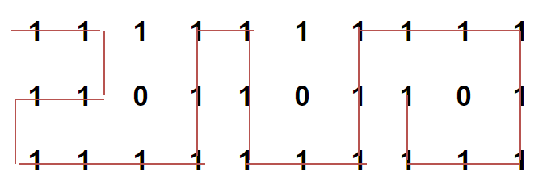

<a href="https://practice.geeksforgeeks.org/problems/longest-possible-route-in-a-matrix-with-hurdles/1#"><h1>Longest Possible Route in a Matrix with Hurdles</h1></a>

- <h3>Question</h3>
    Given an N x M matrix, with a few hurdles(denoted by 0) arbitrarily placed, calculate the length of the longest possible route possible from source(xs,ys) to a destination(xd,yd) within the matrix. We are allowed to move to only adjacent cells which are not hurdles. The route cannot contain any diagonal moves and a location once visited in a particular path cannot be visited again.If it is impossible to reach the destination from the source return -1.

- <h3>Examples</h3>
    

    <b>Example 1:</b>

    Input: 
    {xs,ys} = {0,0} 
    {xd,yd} = {1,8} 
    matrix: 
            1 1 1 1 1 1 1 1 1 1 
            1 1 0 1 1 0 1 1 0 1 
            1 1 1 1 1 1 1 1 1 1 
    Output: 24 
    Explanation: 
     
    

     
    

    <b>Example 2:</b>

    Input: 
    {xs,ys} = {0,3} 
    {xd,yd} = {2,2} 
    matrix: 
            1 0 0 1 0 
            0 0 0 1 0 
            0 1 1 0 0 
    Output: -1 
    Explanation: We can see that it is impossible to reach the cell (2,2) from (0,3). 
    

     

- <h3>Constraints</h3>
    → 1 <= N,M <= 10  

